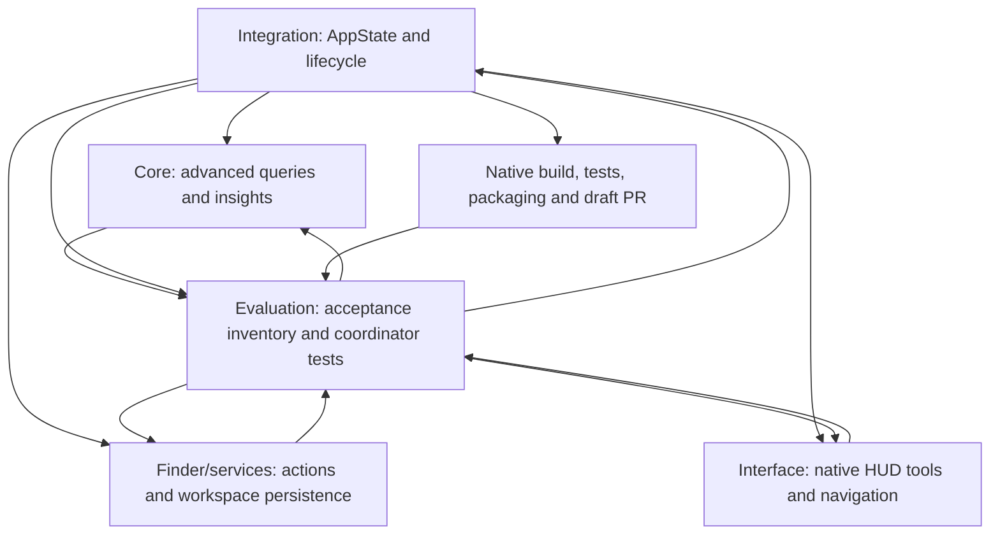

# Hoover advanced feature evaluation

Evaluation began on **2026-10-04 (UTC)** in a Linux cloud workspace. This record covers the advanced expansion listed in [Advanced-Features.md](Advanced-Features.md). Current results below are pending until the implementing agents deliver their contracts and the integrated revision completes the relevant checks.

The earlier Hoover 1.0.1 results in [Evaluation.md](Evaluation.md) are baseline evidence. They do not establish that the thirty new features work, or that the user's previously reported Active/List-view/no-overlay failure has been resolved on their Mac.

## Verification inventory

| Feature numbers | Portable local verification | Native automated verification | Interactive Mac verification |
| --- | --- | --- | --- |
| 1–6, compound queries and filters/order | PENDING: parser, combined conditions, boundary values, stable ordering, root-confined ancestry. | PENDING: AppState integration, latest-query ordering, unchanged root, Escape restoration. | PENDING: query field editing, visible filter/error state, sorting response. |
| 7–10, folder insights | PENDING: real indexed records, complete/partial counts, largest/recent ordering, duplicate names. | PENDING: coordinator insight updates and stale-result cancellation. | PENDING: insight panel rendering, real result selection, interaction during indexing. |
| 11–13, saved workspace | Not established by portable core tests. | PENDING: local persistence, deduplication/bounds, saved query applied to the current root, missing locations. | PENDING: add/remove/open workflows and restart behavior. |
| 14–17, navigation and pinning | Not established by portable core tests. | PENDING: coordinator keyboard/breadcrumb/match transitions and explicit dismissal of pinned state. | PENDING: keyboard focus, text editors, pointer/app switching, pin indicator, preserved double-click. |
| 18–20, visibility/index/export | PENDING where portable APIs apply: CSV quoting and real snapshot values. | PENDING: hidden refresh, superseded reindex, partial export metadata and selection. | PENDING: native save panel, overwrite handling, responsive rendering during rebuild. |
| 21–23, filesystem mutations | Not established by portable core tests. | PENDING: disposable real rename/duplicate/new-folder fixtures, validation/collisions, callback refresh. | PENDING: native dialogs, cancellation, errors and session updates. |
| 24–25, clipboard representations | Not established by portable core tests. | PENDING: relative-root boundary and actual encoded file URL; preserve accessible existing clipboard data. | PENDING: copying from real HUD/tree selections and pasting in another app. |
| 26–27, sharing and Terminal | Not established by portable core tests. | PENDING: any reusable path/argument preparation contract. Native invocation needs an explicit test scope. | PENDING: actual share interface, intended Terminal directory, metacharacter filenames and cancellation. |
| 28–29, checksum and Finder tags | Not established by portable core tests. | PENDING: known digest, regular-file/symlink policy, bounded/cancellable work, tag read/write with exact fixture cleanup. | PENDING: long checksum responsiveness, stale selection handling, Finder tag reflection and permissions. |
| 30, hover diagnostics | Not established by portable core tests. | PENDING: truthful observation/permission/blocked states where exposed for testing. | PENDING: actual Finder hits, Accessibility grants, missing hits, backgrounds and view variants. |

No interactive desktop item in this inventory has been verified by this cloud session. Native Apple SDK compilation and macOS CI are required for the integrated source. Passing native coordinator tests still does not establish actual Accessibility hit detection, mouse/keyboard interception, Finder/default-app opening, sharing, or Terminal behavior on the user's Mac.

## Agent graph and repair loops

Each implementing agent follows contract → implementation → self-review → test → repair → report. Evaluation follows requirement → independent source/test review → finding → assigned repair → recheck. Integration follows contract review → coordinator/UI integration → local checks → native CI → repair → final independent evidence review.

Evaluation owns only the two Advanced documents and `Tests/HooverMacTests/AdvancedAppStateTests.swift`. Agents do not commit; integration owns the reviewable branch and draft PR.

## Required focused review

- Keep the root fixed during compound filtering, ordering, breadcrumb navigation, and next/previous results. An explicit saved-location choice may start a new session.
- Snapshot preferences before detached work, cancel superseded tasks, and check session/query/selection generations before publishing results or errors.
- Reconcile rename, duplicate, new folder, and tags with actual mutation outcomes; neither failure nor an older task may replace current selection or index state.
- Keep index and checksum work off the main actor; disclose streaming/partial insight and export results.
- Preserve registered default-app file opening, new Finder-window folder opening, successful HUD dismissal, two-step search Escape, and text-editing keyboard behavior.

## Evidence and remaining limits

Local checks: **PENDING**. Native test/build/package workflow: **PENDING**. Integrated source SHA, test totals, artifact links, and any repairs will be recorded only after the corresponding checks actually complete. Live Mac acceptance: **PENDING**.

The current cloud session cannot observe or control the user's Mac. A queued or successful CI launch is separate from an observed successful interactive hover session. No test fixture or screenshot harness ships as a demo mode.
