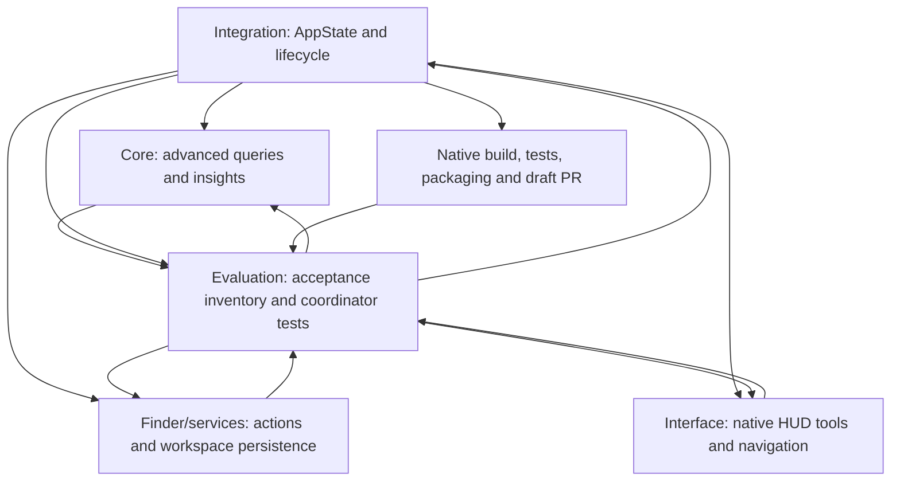

# Hoover advanced feature evaluation

Evaluation began on **2026-10-04 (UTC)** in a Linux cloud workspace. This record covers the advanced expansion listed in [Advanced-Features.md](Advanced-Features.md). Portable checks and independent source/performance review have completed; native results remain pending until the integrated revision completes its macOS workflow.

The earlier Hoover 1.0.1 results in [Evaluation.md](Evaluation.md) are baseline evidence. They do not establish that the thirty new features work, or that the user's previously reported Active/List-view/no-overlay failure has been resolved on their Mac.

## Verification inventory

| Feature numbers | Portable local verification | Native automated verification | Interactive Mac verification |
| --- | --- | --- | --- |
| 1–6, compound queries and filters/order | PASS: core suite reports 42 cases, including parser/conditions/boundaries/stable ordering and root ancestry; independent optimized real-tree filtering also passed. | PENDING: AppState integration, latest-query ordering, unchanged root, Escape restoration. | PENDING: query field editing, visible filter/error state, sorting response. |
| 7–10, folder insights | PASS: core insight tests and independent 100,000-file record/count/size/list-limit assertions. | PENDING: coordinator insight updates and stale-result cancellation. | PENDING: insight panel rendering, real result selection, interaction during indexing. |
| 11–13, saved workspace | Not established by portable core tests. | PENDING: local persistence, deduplication/bounds, saved query applied to the current root, missing locations. | PENDING: add/remove/open workflows and restart behavior. |
| 14–17, navigation and pinning | Not established by portable core tests. | PENDING: coordinator keyboard/breadcrumb/match transitions and explicit dismissal of pinned state. | PENDING: keyboard focus, text editors, pointer/app switching, pin indicator, preserved double-click. |
| 18–20, visibility/index/export | Core indexing is covered; native coordinator CSV output is not established by portable tests. | PENDING: hidden refresh, superseded reindex, CSV quoting/partial metadata and selection. | PENDING: native save panel, overwrite handling, responsive rendering during rebuild. |
| 21–23, filesystem mutations | Not established by portable core tests. | PENDING: disposable real rename/duplicate/new-folder fixtures, validation/collisions, callback refresh. | PENDING: native dialogs, cancellation, errors and session updates. |
| 24–25, clipboard representations | Not established by portable core tests. | PENDING: relative-root boundary and actual encoded file URL; preserve accessible existing clipboard data. | PENDING: copying from real HUD/tree selections and pasting in another app. |
| 26–27, sharing and Terminal | Not established by portable core tests. | PENDING: any reusable path/argument preparation contract. Native invocation needs an explicit test scope. | PENDING: actual share interface, intended Terminal directory, metacharacter filenames and cancellation. |
| 28–29, checksum and Finder tags | Not established by portable core tests. | PENDING: known digest, regular-file/symlink policy, bounded/cancellable work, tag read/write with exact fixture cleanup. | PENDING: long checksum responsiveness, stale selection handling, Finder tag reflection and permissions. |
| 30, hover diagnostics | Not established by portable core tests. | PENDING: truthful observation/permission/blocked states where exposed for testing. | PENDING: actual Finder hits, Accessibility grants, missing hits, backgrounds and view variants. |

No interactive desktop item in this inventory has been verified by this cloud session. Native Apple SDK compilation and macOS CI are required for the integrated source. Passing native coordinator tests still does not establish actual Accessibility hit detection, mouse/keyboard interception, Finder/default-app opening, sharing, or Terminal behavior on the user's Mac.

## Agent graph and repair loops

Each implementing agent follows contract → implementation → self-review → test → repair → report. Evaluation follows requirement → independent source/test review → finding → assigned repair → recheck. Integration follows contract review → coordinator/UI integration → local checks → native CI → repair → final independent evidence review.

Evaluation owns only the two Advanced documents and `Tests/HooverMacTests/AdvancedAppStateTests.swift`. Agents do not commit; integration owns the reviewable branch and draft PR.

## Required focused review

- Keep the root fixed during compound filtering, ordering, breadcrumb navigation, and next/previous results. An explicit saved-location choice may start a new session.
- Snapshot preferences before detached work, cancel superseded tasks, and check session/query/selection generations before publishing results or errors.
- Reconcile rename, duplicate, new folder, and tags with actual mutation outcomes; neither failure nor an older task may replace current selection or index state.
- Keep index and checksum work off the main actor; disclose streaming/partial insight and export results.
- Preserve registered default-app file opening, new Finder-window folder opening, successful HUD dismissal, two-step search Escape, and text-editing keyboard behavior.

## Evidence and remaining limits

Independent native-source/test parsing and whitespace checks: **PASS**. The new `AdvancedAppStateTests.swift` contains eleven coordinator/keyboard/CSV/diagnostic tests; execution remains pending the integrated macOS workflow. These tests use real temporary trees, isolate both settings and workspace preferences, and omit preview subprocesses that are unrelated to coordinator behavior.

An initial optimized Linux evaluation created **100,000 actual empty files** in 100 directories, indexed 100,101 records in 4.585 seconds, and received the first batch in 1.9 ms. Exact assertions passed: kind/extension filters returned 100,000 files; the size filter above 10 MB returned zero; a relative-path filter returned its branch folder plus 1,000 files, retaining 1,002 ancestry IDs. Compound kind/extension/size/path filtering returned exactly 1,000 files and the same ancestry.

Initial timings were 424 ms for the broad kind filter, 365 ms for extension, 87 ms for no size matches, 595 ms for the path filter, and 632 ms for compound filtering. Insights counted 100,100 descendants, 100,000 files, 100 folders and zero bytes in 1.068 seconds, with largest/recent lists bounded at 50. Evaluation requested reducing repeated relative-path normalization and unnecessary sorting of equally ranked filter-only candidates; any final repaired timings will be recorded separately. These timings describe optimized Linux core work, not macOS interaction latency or peak memory. The fixture and temporary executable were removed after the run.

The repaired core uses a fast ASCII path matcher with a Unicode-normalization fallback, prepares extension bytes once, and preserves stable source order for equally ranked filter-only matches; explicit UI ordering remains separate. A final independent rerun passed the same exact assertions: indexing took **4.640 seconds**, first batch **2.3 ms**, broad kind **288 ms**, extension **242 ms**, no size matches **91 ms**, path **98 ms**, and compound filtering **120 ms**. Insights completed in **924 ms**. All 100,000 real files and the temporary executable were removed. The core agent's final source check reported **42 passing portable XCTest cases**, native Swift parsing and bundle metadata validation.

## Findings and rechecks

- Reusable saved filters intentionally apply to the current root; they do not reopen an earlier scope. Acceptance text and coordinator tests reflect that contract.
- Cross-file coordinator/action helpers use access levels compatible with Swift extensions; native Finder-tag writing uses the writable NSURL API.
- Workspace preferences are injected into native test fixtures, preventing disposable test roots from being recorded in a developer's standard preferences.
- New-folder creation checks the lexical and canonical root boundary and the descendant symlink policy. UI entry points use the scoped coordinator path; an explicitly chosen symlink root remains valid.
- Export snapshots retain row-level index status. Export errors check the originating session before updating the current UI.
- Explicit workspace switching waits while a file action is running, preventing a mutation's later result from affecting a different root.
- Search cancellation now cancels the exact detached worker through a cancellation handler, allowing core cancellation checkpoints to stop superseded searches as well as rejecting stale publication.
- Duplicate-name UI wording describes items, including folders, and does not claim equal file contents. TypeScript extension classification uses the code category.

Integrated native test/build/package workflow: **PENDING**. Final source SHA, exact test totals, artifact links and native repair evidence will be recorded only after the corresponding checks actually complete. Live Mac acceptance: **PENDING**.

The current cloud session cannot observe or control the user's Mac. A queued or successful CI launch is separate from an observed successful interactive hover session. No test fixture or screenshot harness ships as a demo mode.
