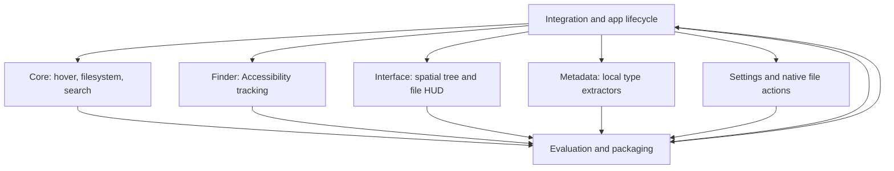

# Hoover implementation graph

Each implementation agent follows inspect → implement → self-review → test/repair → report.
The evaluation agent follows requirements → tests/build → findings → repair request → recheck.
Integration follows contract review → integrate → test → repair → evaluation → package.
The available environment supports six concurrent subagents plus the integration agent.
The requested maximum of twenty is a ceiling, not a required agent count.

No user-facing demo mode or simulated Finder session is included.
